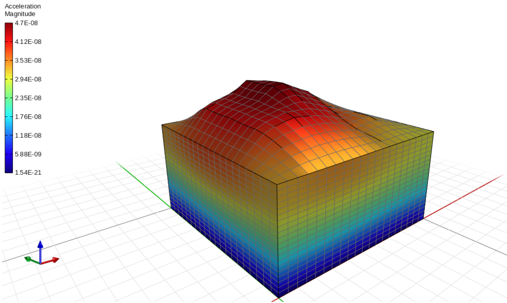

\
\
\

OPENSTOOLS
==========

**A python code to pre-process the finite element models in the OpenSees and OpenSeesSP software**

**POLITECNICO DI BARI** - **DRSATE XXXVIII PhD cycle**\
**author:** GIANLUCA CAVALLO\
**year: 2023**\
**email:** gi.cav.2586@gmail.com\
**email:** g.cavallo@phd.poliba.it\
**note:** Please, cite the author if use any part of this code\
**note:** This code is part of the phd study course with the Supervisor: Prof. G Elia and Scientific Director: Prof.ssa Federica Cotecchia.\
**note:** This code will be used only for scientific purposes. no commercial objectives will be sought\
**note:** The user accept in use this code in all of its part for noncommercial purposes only\

All rights reserved to:
- University of California - Office of technology licensing.
- Gmsh is copyright (C) 1997-2024 by C. Geuzaine and J.-F. Remacle (see the CREDITS file for more information) and is distributed under the terms of the GNU General Public License (GPL) (version 2 
  or later, with an exception to allow for easier linking with external libraries). 
- ASDEA Software Technology: https://asdeasoft.net 
STKO (Scientific ToolKit for OpenSees): https://asdeasoft.net/stko/ 
Petracca, M., Candeloro, F., & Camata, G. (2017). "STKO user manual". ASDEA Software Technology, Pescara Italy.

REMARKS AND TIPS
----------------
\
The milestone codes followed are those in the opensees and openseespy documentation on 2d and 3d shaked columns\
The file MASTER.py is only a rough example to test the code functionality and it will not lead to a result\
The file MASTER is connected to the tool module "openSTools.py"\
You have to execute the mfix function any times the number of the fixed surfaces, pay attention to the edges\
The same if you want remove the fixies\
Please contact me for some code bugs to correct\
You have to install by pip: openseespy opensees gmsh gmsh2opensees numpy scipy time math os\
Gmsh2Opensees is available from  here: https://github.com/jaabell/gmsh2opensees/archive/refs/heads/main.zip,\
follow the github.com/jaabell/gmsh2opensees instruction to install in your python interpreter.\
Before to install remember to change the g2o_elements_functions.py.\
In gmsh you HAVE TO call Solid the geo-element of dimension 3 or you will get an "invalid 'Solid'" error.\
Whit this code you could perform easily the analysis with every mesh you build with gmsh and 20-8 node up \
element you should take care in the geo_material choice\
Have fun\
\

VIDEO RESULT EXAMPLES
---------------------
[VIDEO EXAMPLE 1 - 3D column](https://drive.google.com/file/d/1Ue9vC5-j3zWNgDACLFwJYLfs1_mDjYV_/view?usp=sharing)\
[VIDEO EXAMPLE 2 - 9_4_QuadUP Slope](https://drive.google.com/file/d/1MoHQG83_UJ0E3Z8VB5SbzlZygr_vr56s/view?usp=sharing)\
\
\
\
\
Copyright @ 1999-2020 The Regents of the University of California (The Regents). All Rights Reserved.\
\
The Regents grants permission, without fee and without a written license agreement, for (a) use, \
reproduction, modification, and distribution of this software and its documentation by educational, \
research, and non-profit entities for noncommercial purposes only; and (b) use, reproduction and \
modification of this software by other entities for internal purposes only. The above copyright \
notice, this paragraph and the following three paragraphs must appear in all copies and modifications \
of the software and/or documentation.\

